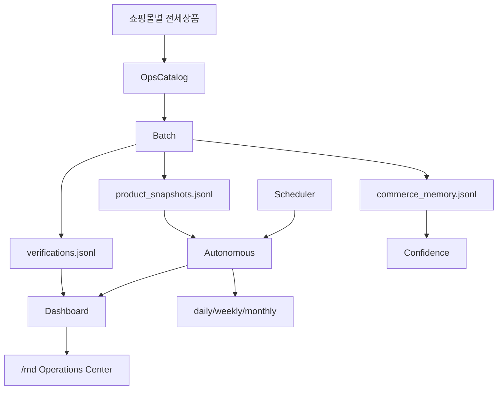
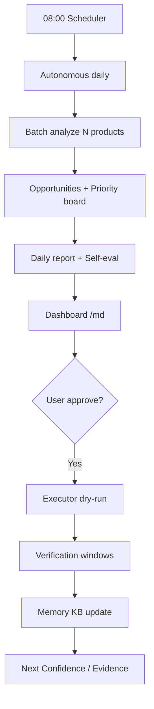

# Architecture — STIX Commerce AI v7 (Production Grade)

## Layers

1. **Collectors** (swappable per marketplace) → `CollectionBundle`
2. **Commerce Intelligence** — SEO + Revenue + Price + Competitor + Thumbnail
3. **Recommendation Engine** — Confidence, Evidence, Expected Impact, Failure Risk, A/B
4. **Execution Planner** — approve-then-run via `MarketplaceExecutor` (dry-run default)
5. **Verification Engine** — D+1 / D+7 / D+14 / D+30 (+ A/B) → Memory
6. **Commerce Memory KB** — contextual success/fail knowledge base
7. **Learning / Knowledge / Self-Eval** — checkpoints, patterns, accuracy grading
8. **Ops** — Batch, Autonomous AI MD, Scheduler, Dashboard, Monitor, API
9. **Stability** — retry / timeout / rate-limit / `safe_call` / error reports
10. **Runtime cache** — TTL (`cache.py`) + mtime JSONL (`jsonl_util.py`)

## Directory map

| Path | Role |
|------|------|
| `analyzer.py` / `pipeline.py` | Single-product analysis orchestration |
| `recommendation_engine.py` / `confidence.py` | Decision quality |
| `memory.py` / `verification.py` / `learning.py` | Persist & learn |
| `batch_ops.py` / `ops_catalog.py` | 100+ real catalog batch |
| `autonomous.py` / `opportunity.py` / `priority.py` / `reports.py` | AI MD daily loop |
| `dashboard.py` / `api.py` / `web/md.html` | Operations Center |
| `scheduler.py` | 08:00 daily job |
| `jsonl_util.py` / `cache.py` | Performance (no behavior change) |
| `stability/` | Logging, resilience, recovery, errors |
| `engines/` | Legacy re-exports (compat shims — do not delete) |

## Data flow



## Sequence — daily MD loop



## JSONL history (`commerce_history/`)

| File | Writer | Readers |
|------|--------|---------|
| `commerce_memory.jsonl` | Memory | Confidence, Knowledge, Dashboard |
| `verifications.jsonl` | Verification | Dashboard, Self-eval, API |
| `product_snapshots.jsonl` | Batch | Reports, Opportunity, Dashboard |
| `learning_events.jsonl` | Learning | Learning due checks |
| `error_reports.jsonl` | stability.errors | Monitor |
| `logs/commerce_ai.log` | logging_setup | Ops |

Reads go through `jsonl_util.read_jsonl` (mtime cache). Writes invalidate cache.

## Executor interface

```
MarketplaceExecutor (ABC)
  ├── NoOpExecutor
  ├── CoupangExecutor
  ├── SmartStoreExecutor
  ├── GmarketExecutor
  ├── AuctionExecutor
  ├── ElevenStExecutor
  └── AmazonExecutor
```

Live mutation requires `live_api=True` + credentials (not enabled by default).

## Logging levels

| Logger | Component |
|--------|-----------|
| `commerce_ai.analyzer` | Analyze |
| `commerce_ai.batch_ops` | Batch |
| `commerce_ai.recommendation` | Recommendation |
| `commerce_ai.confidence` | Confidence (debug) |
| `commerce_ai.memory` | Memory |
| `commerce_ai.verification` | Verification |
| `commerce_ai.dashboard` | Dashboard |
| `commerce_ai.scheduler` | Scheduler |
| `commerce_ai.autonomous` | Autonomous |
| `commerce_ai.self_eval` | Self evaluation |

Levels: ERROR (report_error), WARNING, INFO (milestones), DEBUG (detail).

## Stability

All I/O paths should use `commerce_ai.stability.safe_call` with timeout/retry/rate-limit.
Errors append to `commerce_history/error_reports.jsonl`. Corrupt JSONL lines are skipped.
Missing files return empty collections — process continues.
